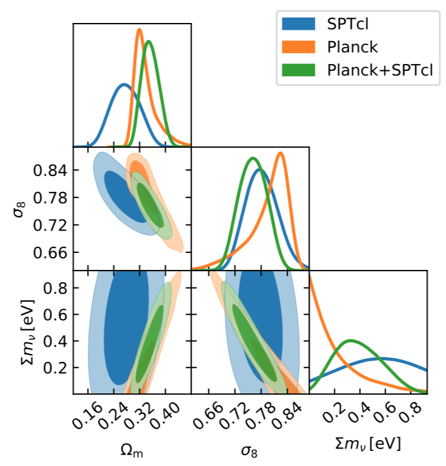
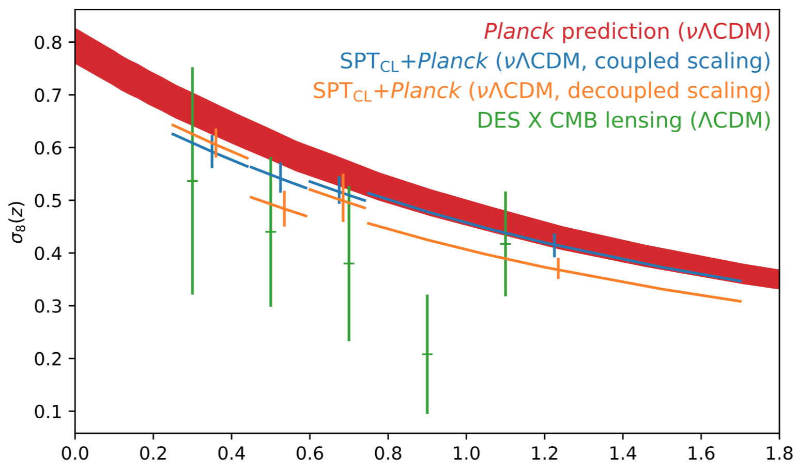

## SPT Galaxy cluster cosmology

*Bocquet S., et al. (2018). Cluster Cosmology Constraints from the 2500 deg2 SPT-SZ Survey: Inclusion of Weak Gravitational Lensing Data from Magellan and the Hubble Space Telescope. [arXiv:1812.01679](https://arxiv.org/abs/1812.01679)*

### Background

Experiments like the South Pole Telescope (SPT) originally set out to do cosmology via clusters. Then, Planck found way fewer clusters than expected, and cluster cosmology became more difficult. Nevertheless, this paper is SPT's most recent measurements.

### Abstract

- Found $\Omega_m = 0.276 \pm 0.047$ and $\sigma_8 = 0.781 \pm 0.037$
- Dark energy equation of state is $w = -1.55 \pm 0.47$, but $w$ goes back to $-1$ when they use only their low redshift clusters
- X-ray scaling relation was not found to be self-similar, despite expectations

### Introduction

- All constraints come from cluster abundances
- Sunyaev-Zel'dovich (SZ) effect in mm., is up-scattering of CMB photons due to intra-cluster medium, which is *independent of redshift*. This means that SZc an detect clusters out to arbitrary redshifts as long as the clusters exist
- New development for this paper is that the mass-observable relation (MOR) is not externally calibrated
- Assumptions:
  - Simulations that model miscentering, triaxiality, correlated large scale structure (LSS) are correct, while a semi-analytic approach is used for uncorrelated LSS.
  - M--SZ relation and M--X-ray relations are power laws in Mass and $E(z)=H(z)/H_0$
  - Intrinsic scatter in MORs is log-normal and correlated
  - Flatness $\Omega_k = 0$
- Uses $M_{\Delta c}$ mass definition with $\Delta=500$ except for the lensing
- Has a signal-to-noise cutoff of $\xi > 5$

### Data

- 377 clusters in SPT footprint
- Weak lensing profiles are from Magellan (19 clusters) and Hubble Space Telescope (HST; 13 clusters), and are given by $\gamma(\theta)$
- X-ray data is from _Chandra_, with 89 clusters

### Analysis Method

- Uses MORs in $\zeta-M$, $M_{\rm WL}-M$, $M-Y_{\rm X}$ (alt. $M_{\rm gas}$)
- Unbiased SNR is given by $\langle \xi \rangle^2 = \zeta^2 + 3$
- Systematics that _would_ bias cosmology results would amount to additional non-lognormal scatter, an $M$ or $z$ dependence on the scatter, or a redshift dependent mass-slope
- Dusty star forming galaxies and AGN are negligible
- Weak lensing bias encompases the modeling bias and measurement/systematic biases (in terms of DES lingo)
- Weak lensing is statistics dominated
- Likelihood is a multi-observable Poisson distribution, i.e. bins in $\xi$ and $z$
- Tested on mocks created from independent codes
- (Neat) To accommodate the Tinker halo mass function calibration on $\Delta m$, they require $\Omega_m(z) > 0.15$
- Use Metropolis-Hastings and multinest as implemented in [CosmoSIS](https://bitbucket.org/joezuntz/cosmosis/wiki/Home)

### Results

- Only constrain $\Omega_m$ and $\sigma_8$, but not really the other parameters
- Did not use a prior on $\Omega_b$ from BBN
- Goodness of fit determined from the [Cash statistic](https://github.com/abmantz/cstat/tree/python)
- No prior on the MORs, but still found consistency with the 2016 version of this analysis ($p=0.86$)
- DE equation of state was low $w=-1.55$, but came back up when using only low redshift clusters (a little bird told me that it is probably a problem with the X-ray clusters)
- $\sigma_{\ln Y_X}$ and $\sigma_{\ln \xi}$ are degenerate, but demonstrate a requirement of _some_ scatter
- no strong constraint on the sum of neutrino masses yet $\Sigma m_\nu$

### Summary

- Mass calibration limited by weak lensing data (and will get mostly a much better constraint on $\Sigma m_\nu$ when available)
- Self-similarity in redshift is seen, but not in the mass-slope, which is unexpected (also was told it's probably the X-ray data)
- Cool way to see the growth of structure in terms of $\sigma_(z)$, which is consistent with $\Lambda CDM$

